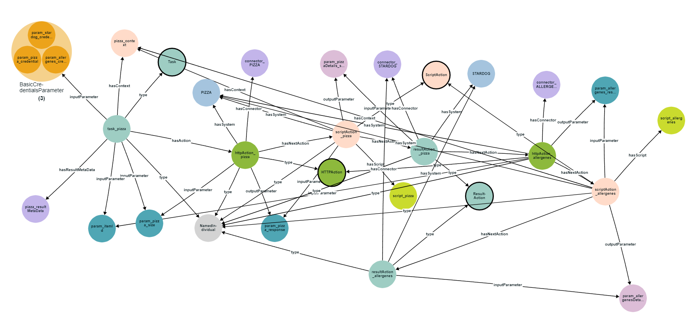

# PIZZA Use-case

This example is designed for Pizza use-case. A person wants to order a Pizza, and he also wanted to know about the allergens 
so that he can mention that while ordering Pizza. The details about the pizza is available in one site and the 
allergens details are available on another site. So It's difficult to order. To overcome this problem, we have created a 
flow  graph which will call these two endpoints and combine the Pizza ingredients with its respective allergens.

## How does pizza ofg works?
* **httpAction_pizza & httpAction_allergenes** is defined to make api calls to the endpoints. 
* **scriptAction_pizza & scriptAction_allergenes** is defined to transform the api response into knowledge graph. Groovy 
Script is used for the transformation. API response is combined with context to form JSON-ld. Then JSON-ld is saved into
in-built Dataset memory. Finally, construct query is fired on Dataset to get the knowledge graph. 
* **resultAction_pizza & resultAction_allergenes** is defined to load the transformed RDF data into Named Graph in stardog

**(These instances are linked using object properties to complete the flow)**

## Prerequisites

- **JSON Webserver**

# QuickStart
## Technical Note

Add pizza_allergens mock response in JSON Webserver, which exposes the pizza & allergens response through these
endpoints **http://localhost:3000/pizzas & http://localhost:3000/allergenes**

## Quick links

[Steps to configure JSON Webserver](https://www.geeksforgeeks.org/json-server-setup-and-introduction/)